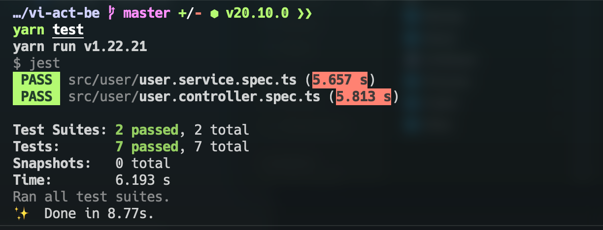
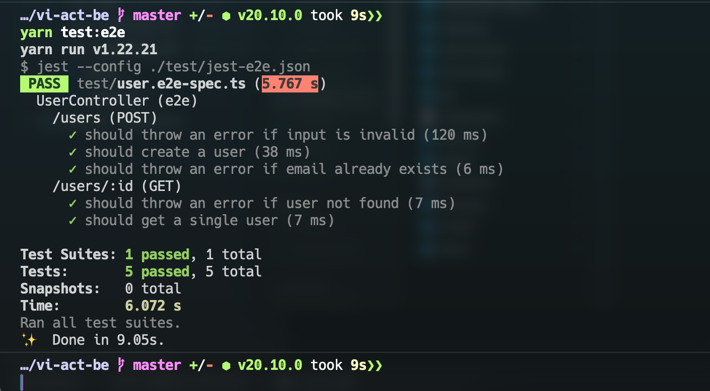
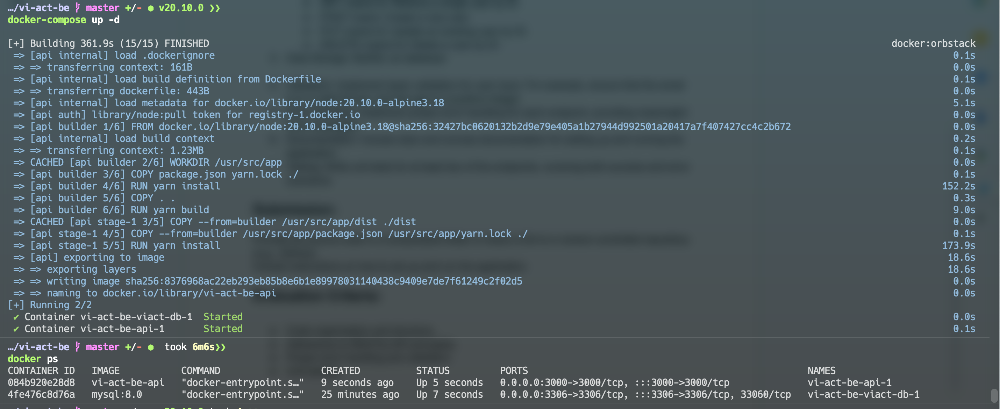
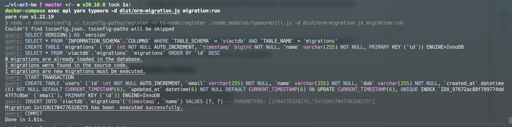
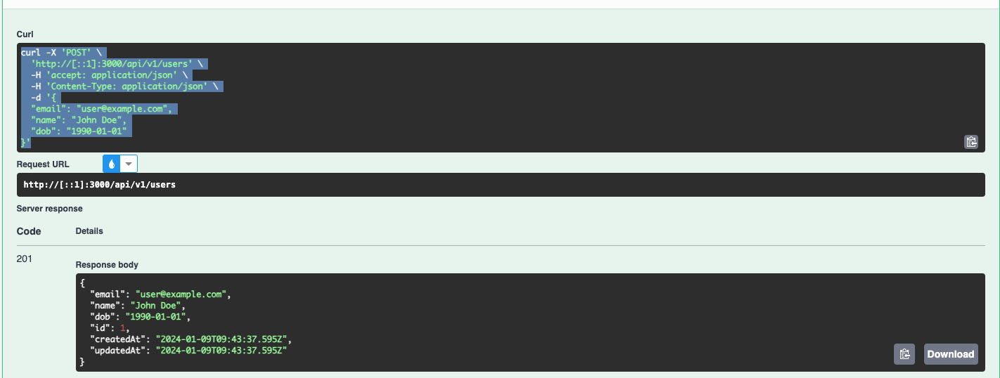
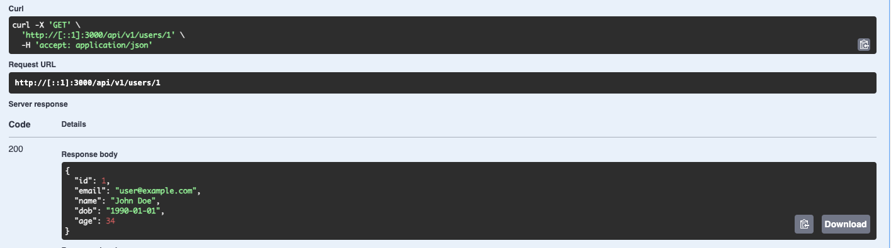
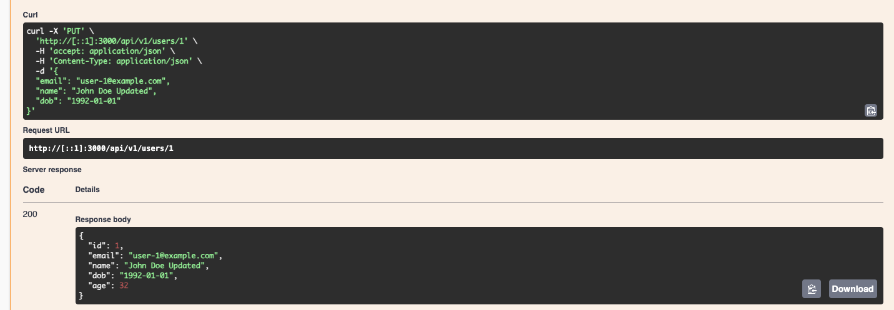
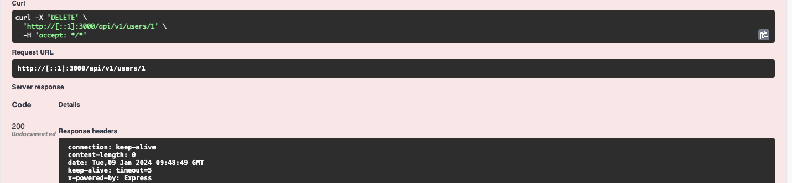
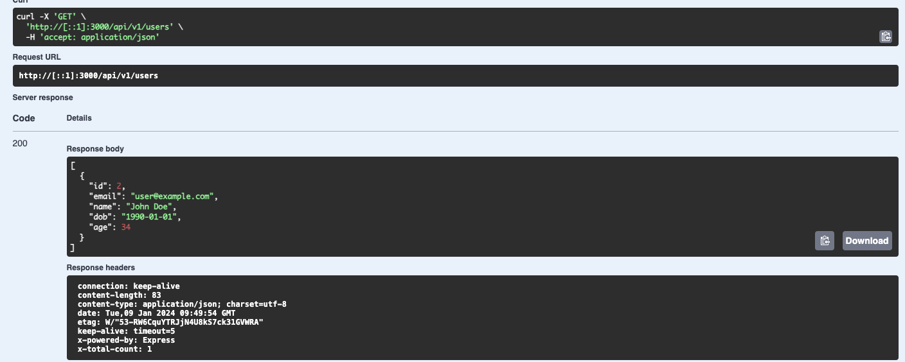

# Overview

This project includes three modules:

- Common Module (a global module)
- User Module (a feature module)

```sh
├── src
│   ├── migrations # Database migrations
│   ├── common # Common module
│   │   ├── async-storages # Async storages
│   │   ├── decorators # Custom decorators
│   │   ├── middlewares # Custom middlewares
│   ├── user # User module
│   │   ├── dto # Data transfer objects
│   │   ├── entities # Database entities
│   │   ├── *.service.ts # Business logic
│   │   ├── *.controller.ts # Routes
│   │   ├── user.module.ts # User module
│   ├── config.ts # Configuration file get from environment variables
│   ├── orm-migration.ts # This will help typeorm know where to find the connection options when run from the command line
│   ├── main.ts # Entry point of the application
│   ├── app.module.ts # Root module
```

## Run the app locally

1. Clone this repo
2. Navigate to the project root directory with `cd vi-act-be`
3. Install dependencies with `yarn install`
4. Run tests with `yarn test`



5. Run e2e tests with `yarn test:e2e`



6. Start project with docker-compose



7. Start migration with `yarn migrate:run`

```sh
docker-compose exec api yarn typeorm -d dist/orm-migration.js migration:run
```



## Swagger API Documentation <http://[::1]:3000/docs>

## Test

1. Create new user

```sh
curl -X 'POST' \
  'http://[::1]:3000/api/v1/users' \
  -H 'accept: application/json' \
  -H 'Content-Type: application/json' \
  -d '{
  "email": "user@example.com",
  "name": "John Doe",
  "dob": "1990-01-01"
}'
```



2. Get user by id

```sh
curl -X 'GET' \
  'http://[::1]:3000/api/v1/users/1' \
  -H 'accept: application/json'
```



3. Update user

```sh
curl -X 'PUT' \
  'http://[::1]:3000/api/v1/users/1' \
  -H 'accept: application/json' \
  -H 'Content-Type: application/json' \
  -d '{
  "email": "user-1@example.com",
  "name": "John Doe Updated",
  "dob": "1992-01-01"
}'
```



4. Delete user

```sh
curl -X 'DELETE' \
  'http://[::1]:3000/api/v1/users/1' \
  -H 'accept: */*'
```



5. Get all users

```sh
curl -X 'GET' \
  'http://[::1]:3000/api/v1/users' \
  -H 'accept: application/json'
```


